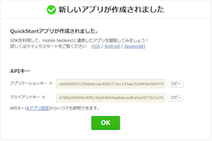

# Swift クイックスタート
_2017/05/17作成_

ニフティクラウド mobile backend を iOS アプリ(Swift)と連携させる手順を紹介します

## 目次
* アプリの新規作成
* SDKをインストールする
 * CocoaPodsを利用する方法
 * SDKをダウンロードして利用する方法
* SDKの読み込み
 * CocoaPodsを利用する方法
 * SDKをダウンロードして利用する方法
* APIキーの設定とSDKの初期化
* サンプルコードの実装
 * サンプルコード（データストア）
 * アプリを実行してニフティクラウド mobile backend のダッシュボードを確認する

## アプリの新規作成

* ニフティクラウド mobile backend にログインします https://console.mb.cloud.nifty.com
* ダッシュボードが表示されたら、「アプリの新規作成」を行います
* すでに別のアプリを作成済みの場合は、ヘッダーの「＋新しいアプリ」をクリックします

 

* 「アプリ名」を入力し「新規作成」をクリックすると、APIキー（アプリケーションキーとクライアントキー）が発行されます

 

* APIキーは後ほどXcodeアプリで使います

* Xcodeでプロジェクトを作成します
 * 既存のプロジェクトを利用する場合はこの作業は不要です

 

* プロジェクトは一度閉じておきます

## SDKをインストールする
### CocoaPodsを利用する方法

#### (1)CocoaPodsをインストールする
※ CocoaPodsがすでにインストールされている方はこちらの作業は不要です。

1. 「`$ sudo gem install cocoapods`」コマンドでcocoaPodsをインストールを行います
2. 「`$ pod setup`」コマンドでセットアップを行います
3. 「`$ pod --version`」コマンドでバージョン情報が表示されればインストール完了です

#### (2)SDKライブラリのインストール
1. 「`$ cd`」コマンドでXcodeプロジェクト内にある「プロジェクト名.xcodeproj」と同じディレクトリに移動します
2. 「`$ pod init`」コマンドでPodfile(インストールするライブラリを指定するファイル)を作成します
3. podfileを開いて、下記(※1)に記載しているの内容に書き換えてください
 * __Xcode7以上の場合__（`use_frameworks!`を使用する方法）

    

 * __Xcode7未満または上記方法が利用できない場合__

    

 ※いずれの場合も「`YOUR_APP_TARGET`」の部分は、作成しているXcodeプロジェクトのプロジェクト名に書き換えてください
4. 編集したpodfileを保存をします
5. 「`$ pod install --no-repo-update`」コマンドでpodfileに書いたSDKをインストールします
6. 「プロジェクト名.xcworkspace」が作成されます
 * 注意：元々ある「プロジェクト名.xcodeproj」からXcodeアプリを開いても、SDKが読み込まれませんので、必ず「プロジェクト名.xcworkspace」から開いて編集を行ってください

#### 参考：SDKのアップデートについて

* 「`$ pod update`」コマンドでSDKのアップデートが可能です
 * Cocoapodsを利用して導入したSDKの場合は上記コマンドの実行だけで更新可能です。
* ローカルに置いたSDKのリポジトリを指定していた場合は以下の方法で更新できます
 * `use_framework!`が使用できない環境の場合はコメントアウトしてください

 

 * 「`YOUR_APP_TARGET`」の部分は、作成しているXcodeプロジェクトのプロジェクト名に書き換えてください

* 上記のようにpodfileを編集（GitHubリポジトリを指定）して、「`$ pod update`」コマンドを実行します

### SDKをダウンロードして利用する方法
#### （１）SDKをダウンロードする

* GitHubのiOS SDKページで「Clone or download ▼」＞「Download ZIP」をクリックし、masterブランチのzipファイルをダウンロードします
* ダウンロードしたzipファイルを解凍してフォルダを開きます
 * フォルダの中には「NCMB」というフォルダがあります。その中のファイルがSDKです。

#### （２）SDKをインストールする

* Xcodeプロジェクトを開きます
* (1)で確認した「NCMB」フォルダをXcodeプロジェクトのターゲットグループ直下（AppDelegateクラスと同じ階層）にコピーします
* フォルダをコピーするときに、Xcodeでポップアップが開くので、次の様に設定します
 * 「Destination」の項目で「Copy items if needed」にチェックを入れる
 * 「Added folders」の項目で「Create groups」を選択する
 * 「Add to targets」の項目でSDKを利用するターゲットを選択する

 

#### 参考：SDKのアップデートについて

* 最新のSDKをダウンロードし、同様の操作で「NCMB」フォルダを置き換えることで、SDKのアップデートが可能です

#### 参考：ARCが無効な環境でSDKを利用する場合

* ARCが無効な環境でSDKを利用する場合は、以下の手順でSDKのみARCを有効にする設定を行います
 * ターゲットの一覧から対象のターゲットを選択
 * 「Build Phases」のタブにある「Compile Sources」を開く
 * ニフティクラウド mobile backend の iOS SDK を構成する全ファイルを選択
 * ダブルクリックして「Compiler Flags」に「-fobjc-arc」を設定

## SDKの読み込み

### CocoaPodsを利用する方法
#### Xcode7以上の場合（`use_frameworks!`を使用する方法）
* `AppDelegate.swift`の冒頭に次のコードを追記して、インストールしたSDKを読み込みます
 * 他のファイルでもSDKを使用する場合は都度追記が必要です

   

#### Xcode7未満または上記方法が利用できない場合
* `AppDelegate.swift`と同じディレクトリに、次の手順でヘッダーファイルを作成します
 1. `AppDelegate.swift`上で右クリック＞「New File...」＞「Header File」＞「Next」をクリックするします
 1. 「`Save As:`」の欄に「`XXXXXXX-Bridging-Header`」と記入（「`XXXXXXX`」のところは任意ですが、プロジェクト名にするのが一般的です）し、「Create」をクリックします

* 作成したファイルの中に下記の内容を追記します

 

* 作成した`XXXXXXX-Bridging-Header.h`ファイルを次の手順で読み込みます
 1. プロジェクト＞「Build Settings」をクリックします
 1. 「Objective-C Bridging Header」（右上の検索を使うとすぐ見つけられます）をダブルクリックすると入力用のふきだしが出てきます
 1. そこに先ほど作成した「`XXXXXXX-Bridging-Header.h`」を下図のようにドラッグ＆ドロップします
 1. ふきだしが閉じ、「`XXXXXXX-Bridging-Header.h`」のディレクトリが入力されたことが確認できれば読み込み完了です

   

### SDKをダウンロードして利用する方法

* 上記「Xcode7未満または上記方法が利用できない場合」と同様の方法でヘッダーファイルを作成し、SDKの読み込みを行ってください

## APIキーの設定とSDKの初期化

* コードを書いていく前に、必ずニフティクラウド mobile backend で発行されたAPIキーの設定とSDKの初期化を行う必要があります
* `AppDelegate.swift`の`didFinishLaunchingWithOptions`メソッド内に次のコードを書きます

 

* 上の「`YOUR_APPLICATION_KEY`」と「`YOUR_CLIENT_KEY`」は、ニフティクラウド mobile backend のダッシュボードで「アプリの新規作成」を行ったときに発行されたAPIキーに置き換えます
 * アプリ作成時のAPIキー発行画面を閉じてしまった場合は、「アプリ設定」＞「基本」で確認できます。「コピー」ボタンを使用してコピーしてください。

   

* これで連携作業は完了です！サンプルコードを書いて実際にニフティクラウド mobile backend を使ってみましょう

## サンプルコードの実装

* `AppDelegate.swift`の`didFinishLaunchingWithOptions`メソッド内に書いた処理は、アプリの起動時に実行されます
 * APIキーの設定とSDK初期化コードの下にサンプルコードを書くと、すぐに動作確認が可能です

* Swift3.0 の場合

 

* Swift2.0 の場合

 

### サンプルコード（データストア）
* 次のコードはニフティクラウド mobile backend のデータストアに保存先の「`TestClass`」というクラスを作成し、「`message`」というフィールドへ「`Hello, NCMB!`」というメッセージ（文字列）を保存するものです

 * Swift3.0 の場合

    

 * Swift2.0 の場合

    

### アプリを実行してニフティクラウド mobile backend のダッシュボードを確認する
* アプリを実機またはシュミレーターで実行します

* アプリが起動されたら、ニフティクラウド mobile backend のダッシュボードで「データストア」から、データが保存されていることを確認できます

 
